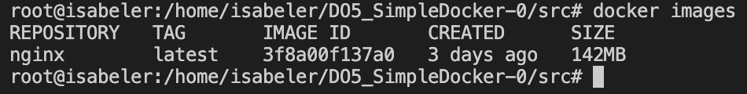

## Part 1. Ready-made docker


> Using `docker pull` for getting official image of nginx from defaul registry `DockerHub`.




> Using `docker images`  in order to know all images that we have


> Using `docker run -d <image:tag>`. 

Flag `-d`  means that we take up our container in the background so we can continue to use terminal in usual way.


> Using `docker ps` in order to find out what procceses is runnig right now in our docker host. 


> Using `docker inspect <container id | container name>` for knowing more pedantic information about our container.


> Using `docker ps --size` in order to know the size of our running containers and also the list of maping ports


> Using specific output format with flag `-f` for know the exact IP address of our container


```
Summing the above information:
1. Ports: 80/tcp
2. Size: 1.09kB (virtual 142MB)
3. IP adress: 172.17.0.2
```


> Using `docker stop` in order to stop procces of our container
>
> PS: If the `container id` is `unique` than we are able to use short-format of it


> Using `docker ps` to ensure that after executing `docker stop` our container was stoped


> Using `docker run` with two varieties of flags: -d (detached mode), -p (port)


> Checking that our nginx is available within port `:80`


> Using `docker restart` in order to restart our container


> The last part of output that shows the procces of restarting our container
>
> PS: for doing this used `docker container logs [container_id | container_name]`
