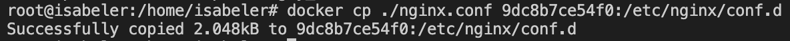

## Part 2. Operations with container

> Using command `docker exec` to execute  command `cat /etc/nginx/nginx.conf` inside our container in order to know the context of `nginx.conf`

> Creating nginx.conf in local machine

> Copying local .conf file into the container

> Reloading nginx inside our container with command `docker exec`

> Checking `/status` page

> Context of `nginx.conf`

> Using `docker export` command to convert our container into archive file

> Using `docker rmi` command with flag `-f` (forcing dispite of some errors) in order to delete our image

> Using `docker ps` command with flag `-a` (short allternative to --all) in order to know all procceses

> Using `docker rm -f` for deleting our stoped container

> Using `docker import` for importing an archive file into a container

> Showing all images in docker host and run `docker run` command in order to take up our container. Accordingly we see an ouput of running `docker ps` that our container is running

> Checking that our nginx server is `working well`
